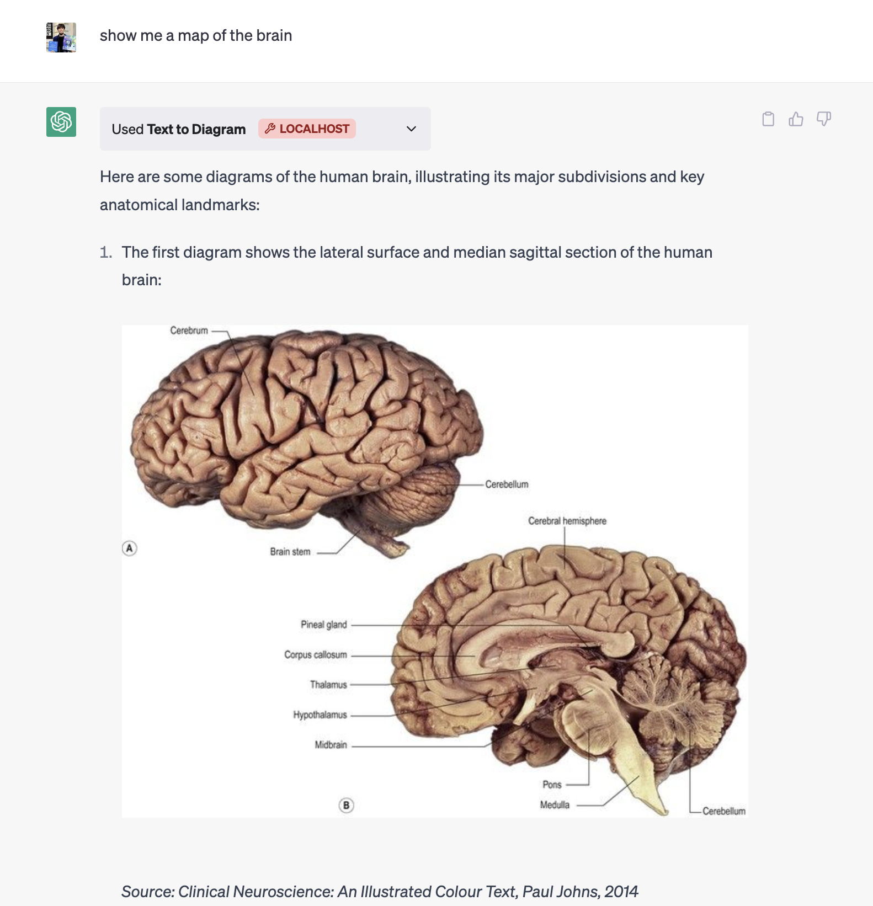
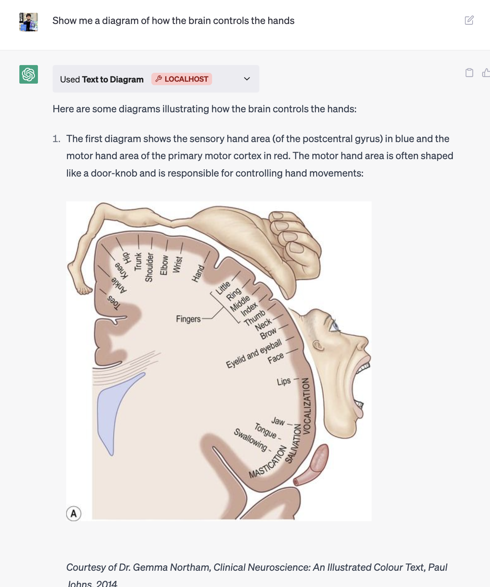

# ChatGPT Textbook Plugin

A ChatGPT plugin to chat with textbooks. 

This is an example of asking the "Deep Learning Textbook" for exact quotes on backpropagation.

Watch the [demo video with more prompts](https://www.loom.com/share/d1705c068a2141c5934d25211477d21a) 

## Usage

This is a fork of https://github.com/openai/chatgpt-retrieval-plugin. This repo adds

- scripts for book manipulation under `scripts/process_book`
- updated textbook datamodel (e.g. chapters)
- updated textbook queries and api prompting 

To add your own textbook you will need (beside the standard repo setup explained in OpenAI repo readme)
1. a file in the form `scripts/process_books/deeplearning.json` 
2. call the command `python scripts/process_books/process_json.py --filepath deeplearning.json`

