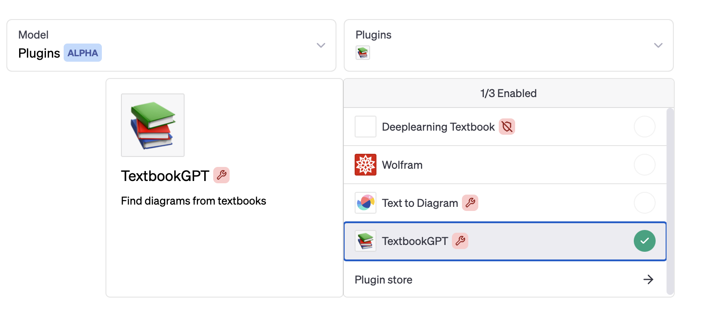
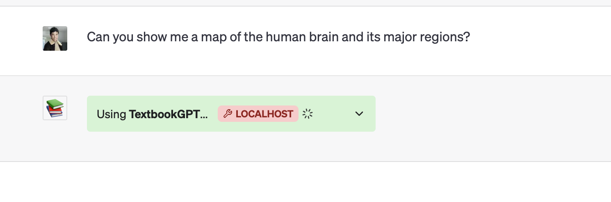
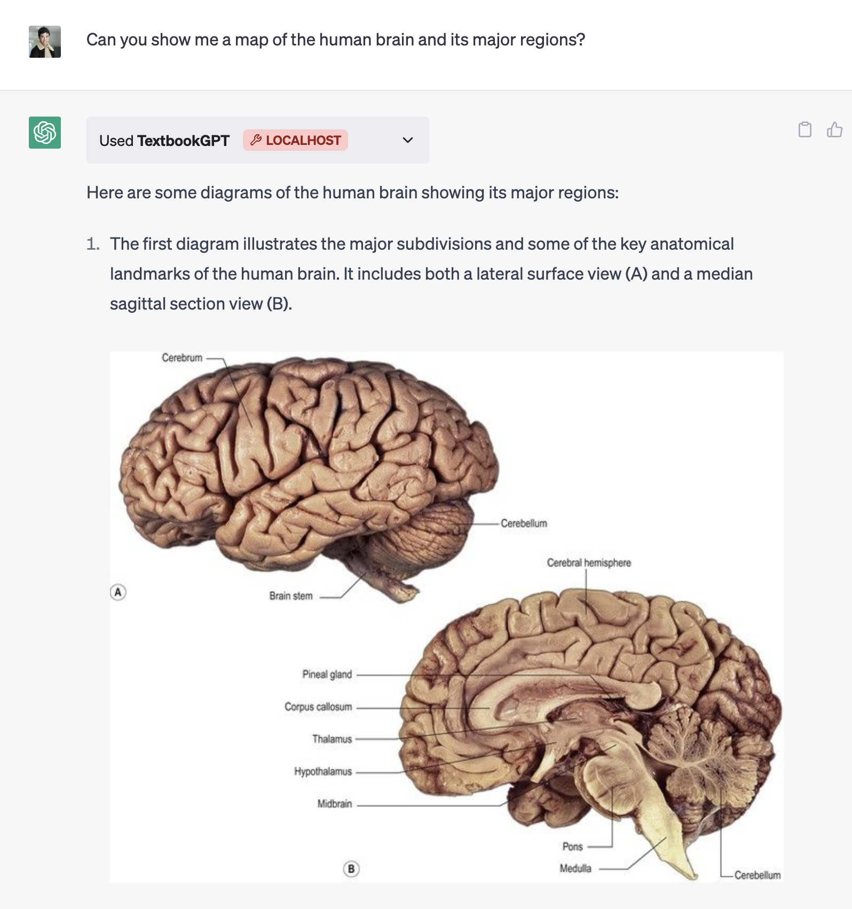
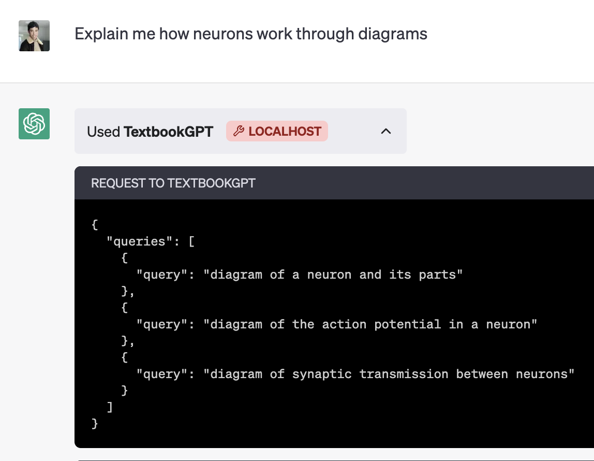
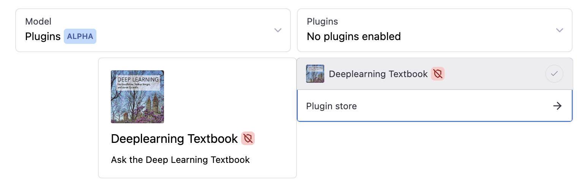
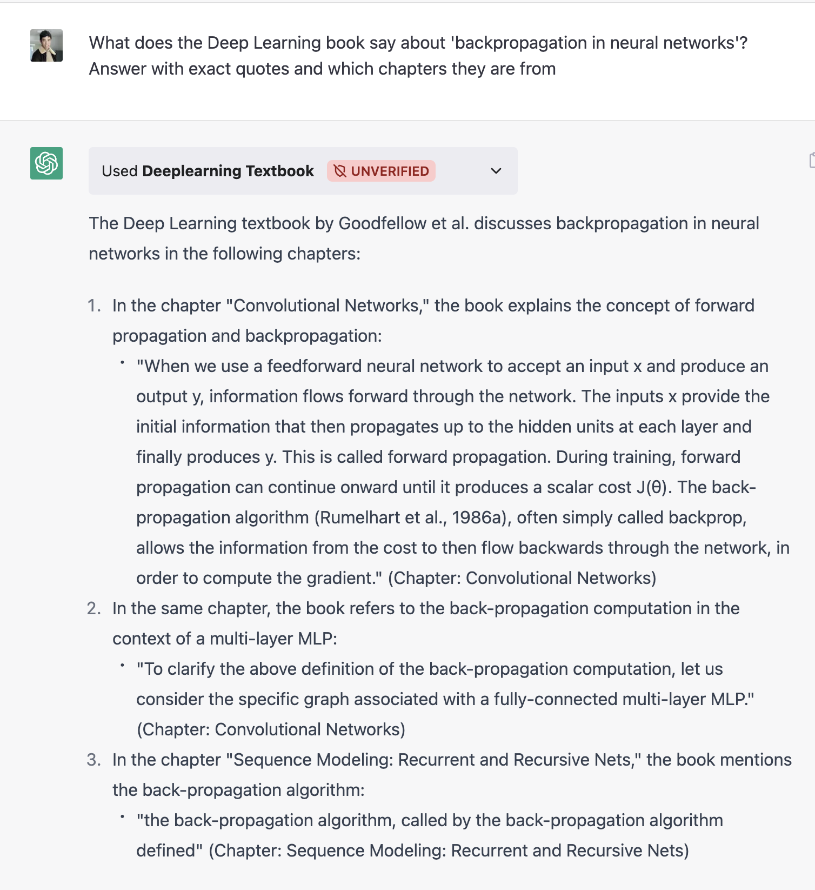

# 📚 **TextbookGPT** (developer access only) 🚀

🗣️ _Chat with textbooks using ChatGPT! Now with ✨ **textbook diagrams** ✨ support_

🎬 [**Textbook Diagrams Demo**](https://youtube.com/shorts/8E2pUd9RiGQ?feature=share) & [**Textbook Paragraphs Demo**](https://twitter.com/lessand_ro)

🐦 **Follow** the author on [Twitter](https://twitter.com/lessand_ro) for updates on our next release!

## 🖼️ Diagrams

_Source-cited diagrams from textbooks right in your chat!_

## 📝 Text Only

_Example: Deep Learning Textbook on backpropagation (from `text-only` branch)_

## 🔧 Usage
💡 Join the OpenAI Plugins early access allowlist

🚀 Deploy this repo on Replit or 💌 DM [me](https://twitter.com/lessand_ro) for our deployment link!

## 💻 Developer Access Quickstart
1. Follow the [**original tutorial**](https://github.com/openai/chatgpt-retrieval-plugin) to set up your vector database
2. Create a file like `scripts/process_books/deeplearning.json`
3. Run `python scripts/process_books/process_json.py --filepath deeplearning.json`
4. Deploy the plugin and enjoy!

_Enhancements over the original repo:_
- Book manipulation scripts
- Updated textbook data model (e.g. chapters & diagrams)
- Improved textbook queries & API prompting

